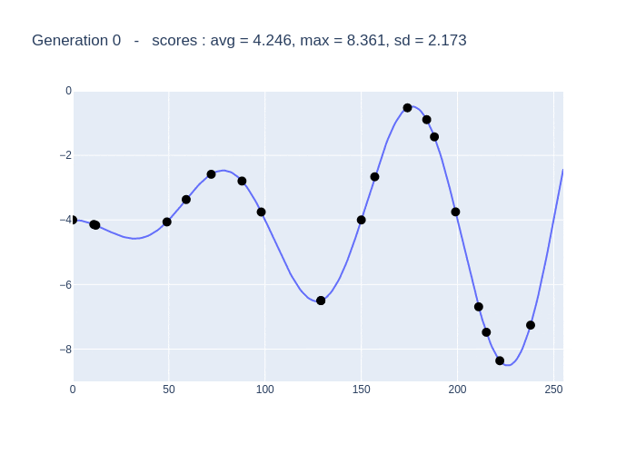

Simple examples of genetic algorithms.
University project, originally with MATLAB, (to be) transcoded in Python.

# Python environment

The project is managed with [Rye](https://rye-up.com/) ([`astral-sh/rye`](https://github.com/astral-sh/rye)).

1. Install Rye
1. `rye sync` creates the venv from `pyproject.toml`
1. If you use VSCode to edit/run Jupyter notebooks, select the Python kernel in `.venv`.

# 1D example : minimize a function with several local minimums

    

# 2D example : image segmentation

> [!NOTE]
> Not transcoded in Python yet, there is only the (french :baguette_bread:) MATLAB code

Genetic algorithm vs Active contour

MATLAB code for active contours :
> **Active Contour MATLAB algorithm from Ritwik Kumar**
> Ritwik Kumar (2022). Snakes: Active Contour Models (https://www.mathworks.com/matlabcentral/fileexchange/28109-snakes-active-contour-models), MATLAB Central File Exchange. Retrieved April 7, 2022. 