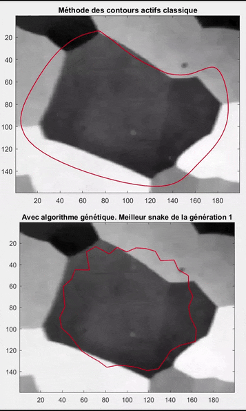

Simple examples of genetic algorithms.
University project, originally with MATLAB, (to be) transcoded in Python.

# Python environment

The project is managed with [Rye](https://rye.astral.sh/) ([`astral-sh/rye`](https://github.com/astral-sh/rye)).

1. Install Rye
1. `rye sync` creates the venv from `pyproject.toml`
1. Open the Jupyter notebook and select the Python kernel in `.venv`.

# 1D example : minimize a function with several local minimums

    

# 2D example : image segmentation

Genetic algorithm vs Active contour.

     
    <em>the genetic algorithm has been speeded up to compare the behavior, not the performance</em>

> [!NOTE]
> Not transcoded in Python yet, there is only the (french :baguette_bread:) MATLAB code

MATLAB code for active contours :
> **Active Contour MATLAB algorithm from Ritwik Kumar**
> Ritwik Kumar (2022). Snakes: Active Contour Models (https://www.mathworks.com/matlabcentral/fileexchange/28109-snakes-active-contour-models), MATLAB Central File Exchange. Retrieved April 7, 2022. 

# License

[MIT](LICENSE.txt), except for the active contour MATLAB algorithm, see [activeContoursSnakesDemo/license.txt](activeContoursSnakesDemo/license.txt).

# Cite this repository

Use the [Cite this repository](https://docs.github.com/en/repositories/managing-your-repositorys-settings-and-features/customizing-your-repository/about-citation-files) GitHub button, or directly the [CITATION.cff](CITATION.cff) file.
